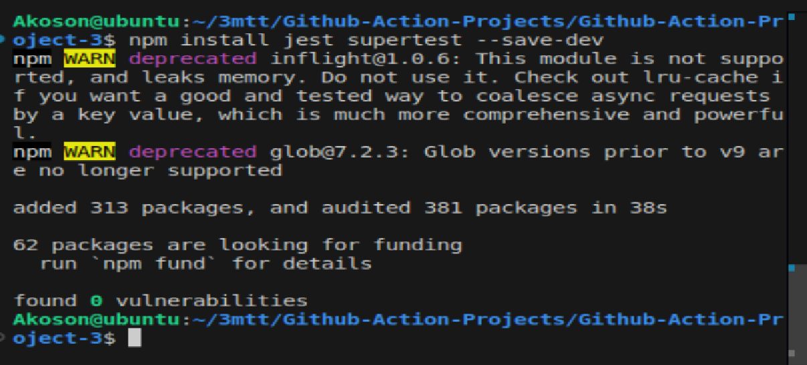
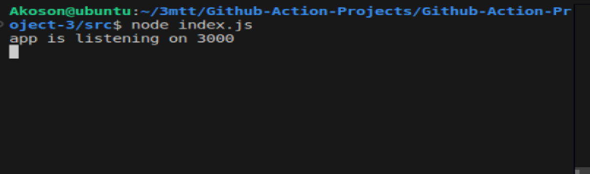
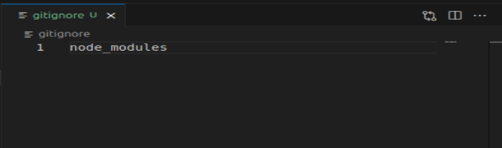
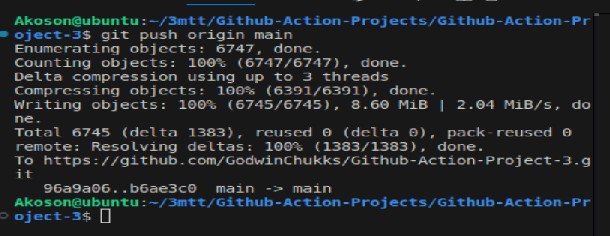
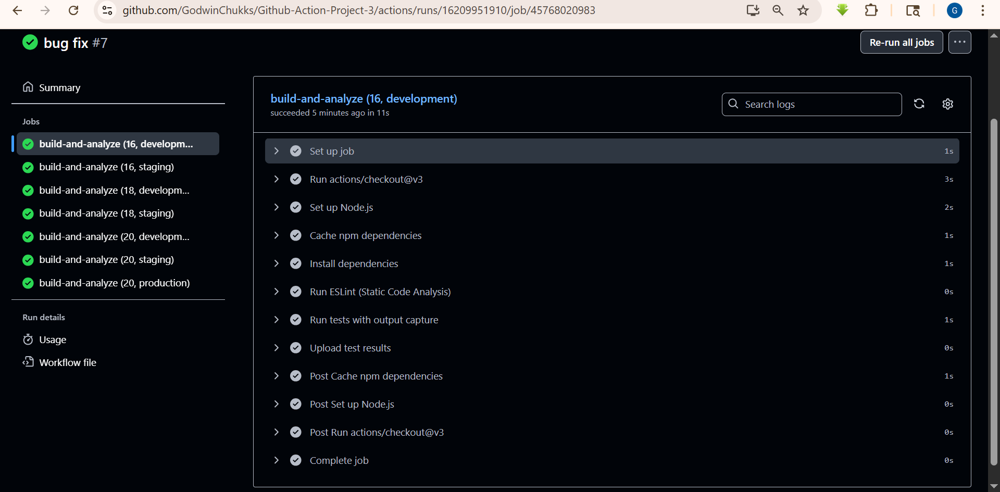

# Github-Action-Project-3

### Github Dashboard


### Clonning repository into the project folder


## Step 1:

### Running `npm init` to generate the `package.json file`


## Step 2:

### Downloading and installing express locally. The command `npm install express` tell Node package manager(npm) tp download and install express locally. 


### `Express` is is a fast, minimalist web framework for Node.js..

### The command installs the latest version of Express from the npm registry into your project's node_modules folder.

## Step 4:

## Installing jest supertest:

### Jest is a testing framework created by Facebook that's widely used with JavaScript, especially in Node.js and React projects. It makes writing and running tests smooth and intuitive.

### Supertest is a library that lets you simulate HTTP requests for testing Express apps or other Node servers. It integrates perfectly with Jest and makes it easy to test your API endpoints.

## When you pair Jest with Supertest:

- Jest handles the structure and assertions

- Supertest handles the HTTP simulation

### Together, they give you clean, fast API testing without spinning up a real server.

### installing jest supertest



The flag `save-dev` meaning they’re only needed during development—not in production.

## Step 5: 

### Create our code base folder for the project


## Step 6:

creating `index.js` file and code


## Step 7:

### creating app.js file and code


## Step 8:

### creating app.test.js file and code


### verifying our code base are successfully created


## Step 9: Testing index.js 



## Step 10:

### updating package.json test script


### Testing to cofirm app is listening on port 3000


### Testing our app locally on the web browser


### Creating gitignore file and passing node_modules file to it



### Running test on our script


### Creating our github workflows


### Push job to Github repository



## Job was successfully build and tested using Github Action


# Impleting Matrix Build to Test Accross Environment and Versions Simulteneously.

### A matrix build lets you define multiple variables (like Node.js versions, operating systems, or environments) and automatically create combinations of them that GitHub Actions will run in parallel.

## Test Across Environment and Versions Simultaneously" Means…

## You can run your tests on:

- Multiple Node versions (e.g. 14, 16, 18)

- Multiple environments (development, staging, production)

- GitHub will spin up jobs like:

- Node 14 + development

- Node 14 + staging

- Node 16 + production

- Node 18 + development ...all at the same time.

### GitHub generates parallel jobs for each combo—so you test how your app behaves under every version/env pairing.

### We also implement in our pipeline dependency caching to speed up future runs, and artifact uploads to preserve results like test reports, logs, or coverage summaries. These additions will make your workflow more efficient and traceable

### update package.json script

```
{
  "name": "github-action-project-3",
  "version": "1.0.0",
  "description": "### Github Dashboard",
  "main": "index.js",
  "scripts": {
    "test": "jest",
    "start": "node index.js"
  },
  "repository": {
    "type": "git",
    "url": "git+https://github.com/GodwinChukks/Github-Action-Project-3.git"
  },
  "keywords": [],
  "author": "",
  "license": "ISC",
  "bugs": {
    "url": "https://github.com/GodwinChukks/Github-Action-Project-3/issues"
  },
  "homepage": "https://github.com/GodwinChukks/Github-Action-Project-3#readme",
  "dependencies": {
    "express": "^5.1.0"
  },
  "devDependencies": {
    "jest": "^30.0.4",
    "supertest": "^7.1.3"
  }
}

```

### Pushing workflow after implementing matrix strategy, dependencies caching and artifact upload


## Successful pipeline run


## Integrating ESLint for linting and static analysis

### updated package.json script

```
{
  "name": "github-action-project-3",
  "version": "1.0.0",
  "description": "NodeJS CI pipeline with GitHub Actions matrix build, linting, and code analysis",
  "main": "index.js",
  "scripts": {
    "start": "node index.js",
    "test": "jest",
    "lint": "eslint ."
  },
  "repository": {
    "type": "git",
    "url": "git+https://github.com/GodwinChukks/Github-Action-Project-3.git"
  },
  "keywords": [],
  "author": "Godwin Chukks",
  "license": "ISC",
  "bugs": {
    "url": "https://github.com/GodwinChukks/Github-Action-Project-3/issues"
  },
  "homepage": "https://github.com/GodwinChukks/Github-Action-Project-3#readme",
  "dependencies": {
    "express": "^5.1.0"
  },
  "devDependencies": {
    "jest": "^30.0.4",
    "supertest": "^7.1.3",
    "eslint": "^8.50.0"
  }
}

```

## 1. Next Steps we Activate ESLint 

### Run `npm install eslint --save-dev`


## 2. Initialize Config (interactive setup):

### Run `npx eslint --init`

## Choose:

- Format: JSON

- Environment: Node and CommonJS

- Style guide: Recommended or customize

### Configuring npx eslint


### pushing workflow pipeline after update


### Successfull build and analyze using ESlint




## Deploying our Project to Heroku

### creating bucket ready for depolyment


### creating secrets for aws deployment


### Successful deploy to aws s3


### confirm aws s3 deployment


### confirming aws s3 deployment


